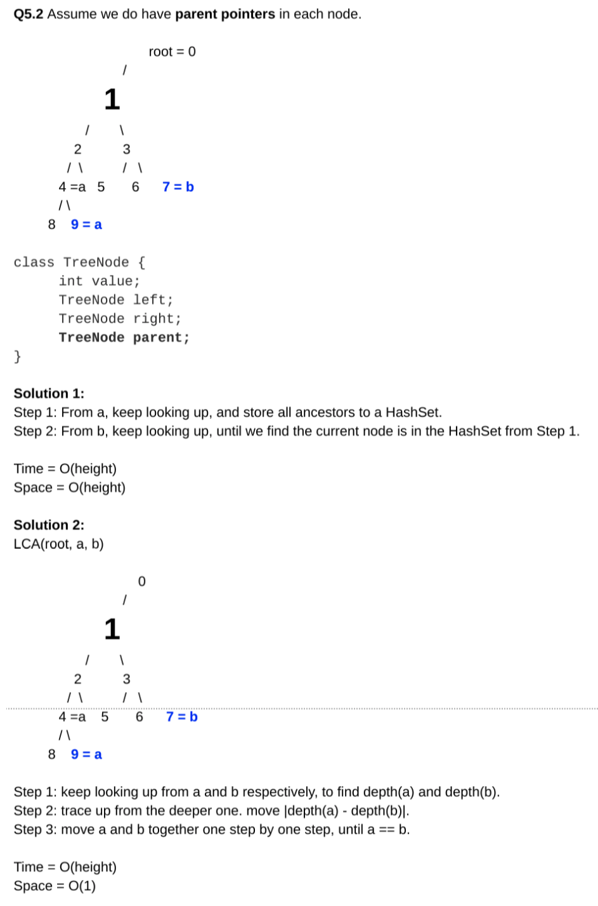

# Lowest Common Ancestor II

[https://app.laicode.io/app/problem/127](https://app.laicode.io/app/problem/127)

## Description

Given two nodes in a binary tree (with parent pointer available), find their lowest common ancestor.

Assumptions

- There is parent pointer for the nodes in the binary tree
- The given two nodes are not guaranteed to be in the binary tree

Examples

            5

          /   \

         9     12

       /  \      \

      2    3      14

The lowest common ancestor of 2 and 14 is 5

The lowest common ancestor of 2 and 9 is 9

The lowest common ancestor of 2 and 8 is null (8 is not in the tree)

Medium

Binary Tree

Linked List

## Assumption

The tree should not be null.

The two nodes are not guaranteed to be in the tree.

The parent pointer of the root node is null.

## Algorithm

[Lowest Common Ancestor I](../LowestCommonAncestorI)

Classic LCA:


This specific problem:



## Solution

### Code

```java
/**
 * public class TreeNodeP {
 *   public int key;
 *   public TreeNodeP left;
 *   public TreeNodeP right;
 *   public TreeNodeP parent;
 *   public TreeNodeP(int key, TreeNodeP parent) {
 *     this.key = key;
 *     this.parent = parent;
 *   }
 * }
 */
public class Solution {

  public TreeNodeP lowestCommonAncestor(TreeNodeP one, TreeNodeP two) {
    // Write your solution here.
    if (one == null || two == null) {
      return null;
    }
    return lca(one, two, getDepth(one), getDepth(two));
  }

  private int getDepth(TreeNodeP node) {
    if (node == null) {
      return 0;
    }
    int depth = 0;
    while (node != null) {
      depth++;
      node = node.parent;
    }
    return depth;
  }

  private TreeNodeP lca(
    TreeNodeP one,
    TreeNodeP two,
    int depthOne,
    int depthTwo
  ) {
    // Corner case: if either of them is null
    if (depthOne == 0 || depthTwo == 0) {
      return null;
    }
    // Traverse from the deeper node until reaching the other node's level
    // At that point, traverse along the two node's parent pointers
    // until reaching a common node
    int diff = depthOne - depthTwo;
    TreeNodeP curr = null;
    if (diff > 0) {
      // Case 1: one sits deeper
      curr = one;
      while (diff > 0) {
        diff--;
        curr = curr.parent;
      }
      // When the two nodes are in the same level
      // Only when we traverse upwards to a common node
      // will we find their lca
      while (curr != two) {
        curr = curr.parent;
        two = two.parent;
      }
    } else {
      // Case 2: two sits deeper
      curr = two;
      while (diff < 0) {
        diff++;
        curr = curr.parent;
      }
      while (curr != one) {
        curr = curr.parent;
        one = one.parent;
      }
    }
    return curr;
  }
}
```

### Complexity

Time:

For this particular question, not every node is checked. Traversal only happens on either node. In the worst case,

1.  the node may sit at the bottom of the tree as a leaf node.
1.  the LCA may be the root or there may not be any LCA at all because of the absence of either node.

⇒ O(height)

Space:

O(1)
