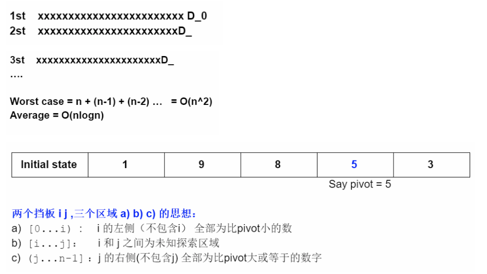
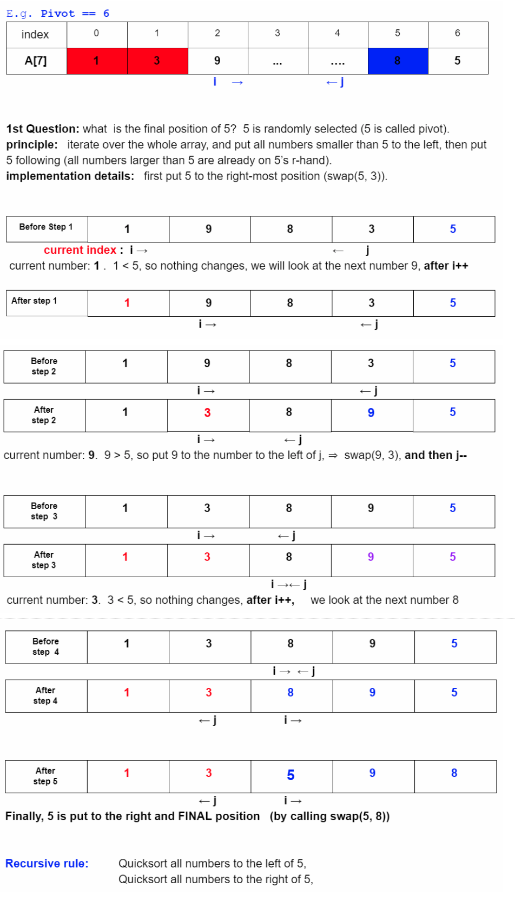

# Quick Sort

[https://app.laicode.io/app/problem/10](https://app.laicode.io/app/problem/10)

## Description

Given an array of integers, sort the elements in the array in ascending order. The quick sort algorithm should be used to solve this problem.

Examples

- {1} is sorted to {1}
- {1, 2, 3} is sorted to {1, 2, 3}
- {3, 2, 1} is sorted to {1, 2, 3}
- {4, 2, -3, 6, 1} is sorted to {-3, 1, 2, 4, 6}

Corner Cases

- What if the given array is null? In this case, we do not need to do anything.
- What if the given array is of length zero? In this case, we do not need to do anything.

Medium

Array

Sort

## Assumption

The input array should not be null or empty.

## Algorithm

1.  Randomly pick an index between start and end as pivot
    1.  This is to try to avoid the worst case scenario of quick sort.
    1.  The worst case scenario is picking the largest/smallest element in the array every time when we try to partition it
    1.  Time complexity of worst case: O(n^2)
1.  Recursively sort the part before/after the pivot point
    1.  (Everything before the pivot) < pivot
    1.  (Everything after the pivot) > pivot
1.  Partition the array
    1.  The randomly picked pivot should be moved to the end of the array for simpler comparisons
    1.  the "right" index should be trimmed to (end - 1) since the end has become the pivot
    1.  Stopping condition of the while-loop should be (left <= right) because:
        1.  To make sure we have checked every element
        1.  When they come across and past each other (left == right + 1), that will make the two pointers/barriers satisfy the physical representation of them:
            1.  (everything on the left) < pivot
            1.  (everything on the right) > pivot
        1.  So, left now points to the first element that is larger than the pivot. Swapping left and the end (pivot position) will bring the pivot to the position that meets its physical meaning





## Solution

### Code

```java
public class Solution {

  public int[] quickSort(int[] array) {
    // Write your solution here
    if (array == null || array.length == 0) {
      return array;
    }
    sortArray(array, 0, array.length - 1);
    return array;
  }

  private void sortArray(int[] array, int start, int end) {
    if (start >= end) {
      return;
    }
    // Find the pivot index
    int pivotIndex = partitionArray(array, start, end);
    // Sort the parts on both sides of the pivot
    // Such that the pivot will be in its correct position
    // Skipping pivot because it is in its designated position
    sortArray(array, start, pivotIndex - 1);
    sortArray(array, pivotIndex + 1, end);
  }

  private int partitionArray(int[] array, int start, int end) {
    // Randomly get an index in [start, end]
    // Use Math.random()
    int pivotIndex = (int) Math.random() * (end - start + 1) + start;
    int pivot = array[pivotIndex];
    // Put the pivot to the end of the array temporarily, such that we
    // can simply check the other elements in one single, continous
    // iteration: 0 → end - 1 → pivot's temporary position
    swap(array, pivotIndex, end);
    // Quick sort physical representation:
    // Two pointers/barriers that satisfy the conditions:
    // 1. Everything before the left pointer is less than pivot
    // 2. Everything after the right pointer is greater than pivot
    // 3. Things in between are unknown and need to be checked
    // 4. When the two pointers meet (left >= right) and pass each
    //    other (left == right + 1):
    //    a. array[left] is the first element that is greater
    //       than pivot
    //    b. array[right] and all elements preceding it are
    //       less than the pivot
    //    c. swap left and end (pivot's temporary position) to meet
    //       the physical representations:
    //       [a, b, c, pivot, x, y, z] where pivot is in its position
    int left = start;
    int right = end - 1; // end ⇒ pivot
    while (left <= right) {
      if (array[left] < pivot) {
        left++;
      } else if (array[right] > pivot) {
        right--;
      } else {
        swap(array, left++, right--);
      }
    }
    swap(array, left, end);
    return left;
  }

  private void swap(int[] array, int indexOne, int indexTwo) {
    int temp = array[indexOne];
    array[indexOne] = array[indexTwo];
    array[indexTwo] = temp;
  }
}
```

### Complexity

#### Time

Partition takes O(n) time to check every element in the array

There are log(n) levels on the stack because we partitioned the array into two parts and recursively sort them ⇒ O(log(n))

In total, O(n log(n)).

_However, if we happen to choose the largest/smallest element to be the pivot in each partition process, the worst-case complexity will be O(n^2)_

#### Space

The recursion tree has log(n) levels ⇒ O(log(n))
