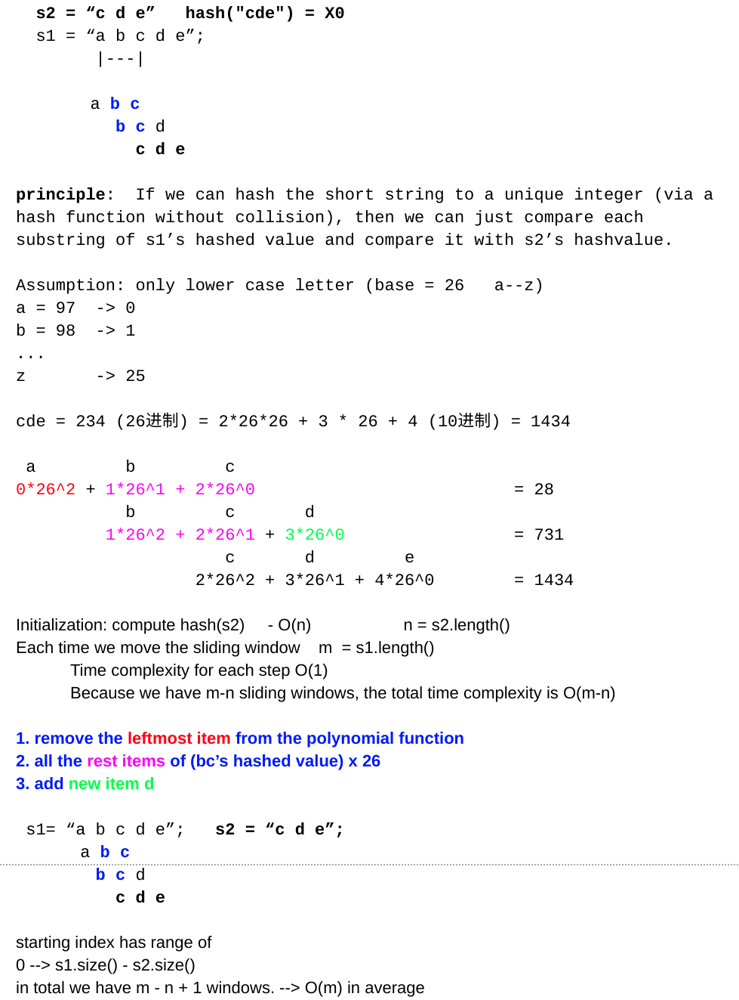

<!----- Conversion time: 0.691 seconds.


Using this Markdown file:

1. Cut and paste this output into your source file.
2. See the notes and action items below regarding this conversion run.
3. Check the rendered output (headings, lists, code blocks, tables) for proper
   formatting and use a linkchecker before you publish this page.

Conversion notes:

* GD2md-html version 1.0β13
* Thu Jan 10 2019 04:37:57 GMT-0800 (PST)
* Source doc: https://docs.google.com/open?id=1hiEuklb1HfNGYZznalcTguAEmhB8m8PiPufzhAOw89A
----->


# Determine if One String is Another's Substring

[https://app.laicode.io/app/problem/85](https://app.laicode.io/app/problem/85)


## Description

Determine if a small string is a substring of another large string.

Return the index of the first occurrence of the small string in the large string.

Return -1 if the small string is not a substring of the large string.

Assumptions


*   Both large and small are not null
*   If small is empty string, return 0

Examples


*   "ab" is a substring of "bcabc", return 2
*   "bcd" is not a substring of "bcabc", return -1
*   "" is substring of "abc", return 0


## Assumption

Neither of the strings shall be null.

If the smaller one is empty, return 0.


## Algorithm


1.  Direct comparison
    1.  loop through the large string
    1.  starting from each index i, look for the smaller string
1.  [Robin-Karp Algorithm](https://en.wikipedia.org/wiki/Rabin%E2%80%93Karp_algorithm)
    1.  logic:
        1.  if we can hash the small string to a unique integer, we can compare each substring in the large string by hash values
    1.  algorithm:
        1.  assume all letters are lowercases
        1.  compute the hash value of the small string
            1.  use a good hash function
        1.  move a sliding window in the large string and compare the substring's hash value to the hash value of the small string

    


## Solution


### Method 1: direct comparison


#### Code


```java
public class Solution {
  public int strstr(String large, String small) {
    // Write your solution here
    if (large == null || small == null) {
      return -1;
    }
    if (large.length() < small.length()) {
      return -1;
    }
    if (small.length() == 0) {
      return 0;
    }
    for (int i = 0; i < large.length() - small.length() + 1; i++) {
      for (int j = 0; j < small.length(); j++) {
        if (small.charAt(j) != large.charAt(i + j)) {
          break;
        }
        if (j == small.length() - 1) {
          return i;
        }
      }
    }
    return -1;
  }
}
```


#### Complexity


##### Time

For every index in the large string, we need to look for the presence of the small string

⇒ O(n * m) ⇒ O(n^2)


##### Space

Constant space ⇒ O(1)


### Method 2: Robin-Karp


#### Code


```java
public int rabinKarp(String large, String small) {
  if (large == null || small == null) {
    return -1;
  }
  if (small.length() == 0) {
    return 0;
  } else if (large.length() < small.length()) {
    return -1;
  }
  // Declare a large prime number as module end
  int largePrime = 101;
  // Because the character set may be very large, i.e. 1,112,064 if using UTF
  // We also need a small prime number to compute the hash value
  int smallPrime = 31;
  int seed = 1;
  // Hash value is computed using the small prime and mod large prime
  // hash_value = (s0*smallPrime^k + s1*smallPrime^(k-1) + ... + sk*smallPrime^0) % largePrime
  int targetHash = small.charAt(0) % largePrime;
  // For the rest of the chars in the string
  // Calculate the final hash value using a rolling hash method
  for (int i = 1; i < small.length(); i++) {
    seed = moduleHash(seed, 0, smallPrime, largePrime);
    targetHash = moduleHash(targetHash, small.charAt(i), smallPrime, largePrime);
  }
  // Compute each substring's hash value in the large string
  // Compute the first substring with the small string's length inside the large string
  int hash = 0;
  for (int i = 0; i < small.length(); i++) {
    hash = moduleHash(hash, large.charAt(i), smallPrime, largePrime);
  }
  if (hash == targetHash && strEquals(large, 0, small)) {
    return 0;
  }
  // Starting from the second character in large, check every substring
  for (int i = 1; i < large.length() - small.length() + 1; i++) {
    // The hash value could not be negative
    hash = forcePositive(hash - seed * large.charAt(i - 1) % largePrime, largePrime);
    hash = moduleHash(hash, large.charAt(i + small.length() - 1), smallPrime, largePrime);
    // There might be hash collisions, so, we need to check if the strings are
    // really the same when their hash value matches
    // The probability of a hash collision is small (O(1))
    // So the complexity does not get increased
    if (hash == targetHash && strEquals(large, i, small)) {
      return i;
    }
  }
  return -1;
}

private int moduleHash(int hash, int addition, int smallPrime, int largePrime) {
  return (hash * smallPrime % largePrime + addition) % largePrime;
}

private boolean strEquals(String large, int start, String small) {
  for (int i = 0; i < small.length(); i++) {
    if (large.charAt(start + i) != small.charAt(i)) {
      return false;
    }
  }
  return true;
}

private int forcePositive(int hash, int largePrime) {
  if (hash < 0) {
    hash += largePrime;
  }
  return hash;
}
```


#### Complexity


##### Time

large.length() = n

small.length() = m


1.  compute hash(small) ⇒ O(m)
1.  sliding window
    1.  compute hash for each char ⇒ O(1)
    1.  (n - m) sliding windows ⇒ O(n - m)

e.g.

    s1 = "abcde", s2 = "cde"

          abc

           bcd

            cde


1.  remove the leftmost item (a) from the polynomial function
1.  all the rest items of (bc's hash value) * 26
1.  add the new item (d) in

Starting index has the range of 0 → s1.length() - s2.length()

There are (n - m + 1) windows in total ⇒ O(m) on average


##### Space

O(1)


<!-- GD2md-html version 1.0β13 -->
