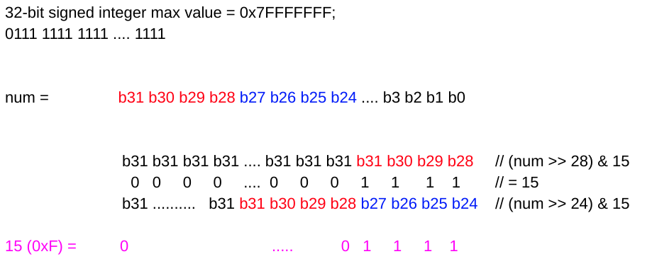

<!----- Conversion time: 0.899 seconds.


Using this Markdown file:

1. Cut and paste this output into your source file.
2. See the notes and action items below regarding this conversion run.
3. Check the rendered output (headings, lists, code blocks, tables) for proper
   formatting and use a linkchecker before you publish this page.

Conversion notes:

* GD2md-html version 1.0β13
* Tue Jan 15 2019 02:50:51 GMT-0800 (PST)
* Source doc: https://docs.google.com/open?id=1CKd1wKOf7zbeByI1wEky9Xt5zL_vClpp6w7l3U5nFMU
* This document has images: check for >>>>>  gd2md-html alert:  inline image link in generated source and store images to your server.
----->


# Hexadecimal Representation

[https://app.laicode.io/app/problem/78](https://app.laicode.io/app/problem/78)


## Description

Generate the hexadecimal representation for a given non-negative integer number as a string. The hex representation should start with "0x".

There should not be extra zeros on the left side.

Examples


*   0's hex representation is "0x0"
*   255's hex representation is "0xFF"


## Assumption

We do not take negative integers into consideration.


## Algorithm

Method 1:


1.  Get each digit of the integer
1.  Convert each digit to its corresponding hexadecimal representation by looking up a map which records <decimal, hex> relationship
    1.  E.g. to get each digit in a decimal number, 1024, we do:
        1.  1024 % 10 ⇒ 4
        1.  102 % 10 ⇒ 2
        1.  10 % 10 ⇒ 0
        1.  1 % 10 ⇒ 1
    1.  So, to get the representation in hex, we will do:
        1.  1024 % 16 ⇒ 0
        1.  64 % 16 ⇒ 0
        1.  4 % 16 ⇒ 4

Method 2:

1 hex bit ⇐ ⇒ 4 binary bit





This is basically a bitwise direct way of getting modulo


## Solution


### Code


```java
public class Solution {
  public String hex(int number) {
    // Write your solution here
    if (number == 0) {
      return "0x0";
    }
    char[] hexBase = {
        '0', '1', '2', '3', '4', '5', '6', '7',
        '8', '9', 'A', 'B', 'C', 'D', 'E', 'F'
    };
    StringBuilder hexResult = new StringBuilder();
    while (number > 0) {
      hexResult.append(hexBase[number % 16]);
      number /= 16;
    }
    // The result is in reversed order now
    hexResult.append("x0");
    hexResult.reverse();
    return hexResult.toString();
  }
}
```


_Bitwise method:_


```
public class Solution {
  public String hex(int number) {
    // Write your solution here
    if (number == 0) {
      return "0x0";
    }
    char[] hexBase = new char[] {
        '0', '1', '2', '3', '4', '5', '6', '7',
        '8', '9', 'A', 'B', 'C', 'D', 'E', 'F'
    };
    StringBuilder hexResult = new StringBuilder("0x");
    // Set a flag to avoid leading zeros in the result
    boolean isLeading = true;
    for (int maskEnd = 28; maskEnd >= 0; maskEnd -= 4) {
      char digit = hexBase[(number >> maskEnd) & 0xf];
      if (isLeading && digit == '0') {
        continue;
      }
      isLeading = false;
      hexResult.append(digit);
    }
    return hexResult.toString();
  }
}
```


### Complexity


#### Time


1.  Getting all the remainders appended takes (log_16(n)), but reversing the StringBuilder takes O(n) ⇒ O(n)
1.  In total, we need to do 8 modulo. Each one of them takes 28, 24, 20, …, 4, 0 bit right shift and a bitwise & with 0xF ⇒ O(1)


#### Space

Both methods use a char array of size 16 that functions as a hash table which records <decimal, hex> relationship


<!-- GD2md-html version 1.0β13 -->
