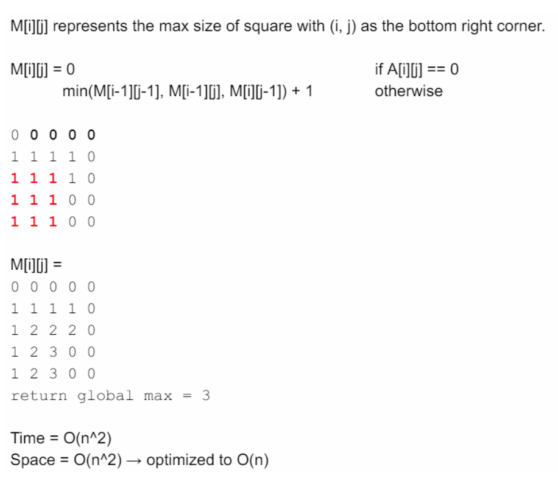

<!----- Conversion time: 1.056 seconds.


Using this Markdown file:

1. Cut and paste this output into your source file.
2. See the notes and action items below regarding this conversion run.
3. Check the rendered output (headings, lists, code blocks, tables) for proper
   formatting and use a linkchecker before you publish this page.

Conversion notes:

* Docs to Markdown version 1.0β14
* Sat Jan 19 2019 02:37:55 GMT-0800 (PST)
* Source doc: https://docs.google.com/open?id=10rDtLA1zP7JOsbv7BCYyCbVTlbuIPOfW07BQqqX82QA
* This document has images: check for >>>>>  gd2md-html alert:  inline image link in generated source and store images to your server.
----->


# Largest Square of 1's

[https://app.laicode.io/app/problem/101](https://app.laicode.io/app/problem/101)


## Description

Determine the largest square of 1s in a binary matrix (a binary matrix only contains 0 and 1), return the length of the largest square.

Assumptions


*   The given matrix is not null and guaranteed to be of size N * N, N >= 0

Examples

{ {0, 0, 0, 0},

  {1, 1, 1, 1},

  {0, 1, 1, 1},

  {1, 0, 1, 1}}

the largest square of 1s has length of 2


Hard

2 D Array


## Assumption

The matrix should not be null or empty. If it is null or empty, we should return 0 because there are no squares in it.


## Algorithm

*   High level:
    *   Every cell (i, j) in the matrix can be treated as a bottom-right corner of a square. Check every cell in the matrix and calculate the length of the side in the square whose bottom-right corner is at (i, j).
*   Implementation
    *   2D DP.
        *   The matrix is guaranteed to be in size of N x N. So, we can maintain a matrix of the same size, named length, to record the length of the side of squares.
        *   At index (i, j), length\[i]\[j] represents the length of the side of the largest square formed whose bottom right corner is at (i, j).
        *   We also need to keep track of the global largest length.





### Solution


#### Code


```java
public class Solution {
  public int largest(int[][] matrix) {
    // Write your solution here
    if (matrix == null || matrix.length == 0) {
      return 0;
    }
    // The size of the matrix is guaranteed to be n x n
    int n = matrix.length;
    // length[i][j] represents the length of the side in a square
    // whose bottom-right corner is matrix[i][j]
    int[][] length = new int[n][n];
    // For every cell/index (i, j) in the matrix, treat it as the
    // bottom-right corner of a square. Calculate the length of
    // the side in such a square
    // Keep track of the max side length
    int maxLen = 0;
    for (int i = 0; i < n; i++) {
      for (int j = 0; j < n; j++) {
        if (i == 0 || j == 0) {
          // Initialize the top row and leftmost column
          length[i][j] = matrix[i][j];
        } else if (matrix[i][j] == 1) {
          length[i][j] = Math.min(length[i][j - 1], length[i - 1][j]);
          length[i][j] = Math.min(length[i][j], length[i - 1][j - 1]) + 1;
        }
        // Update the max side length here rather than in the
        // condition above because there is actually one other
        // condition where matrix[i][j] == 0, but it is
        // emmitted in the if-else block
        maxLen = Math.max(maxLen, length[i][j]);
      }
    }
    return maxLen;
  }
}
```


#### Complexity

Time: nested for-loops ⇒ O(N^2)

Space: int[][] ⇒ O(N^2)


## LeetCode Version

[https://leetcode.com/problems/maximal-square/](https://leetcode.com/problems/maximal-square/)


### Description

Given a 2D binary matrix filled with 0's and 1's, find the largest square containing only 1's and return its area.

Example:

Input:  \
 \
1 0 1 0 0 \
1 0 1 1 1 \
1 1 1 1 1 \
1 0 0 1 0 \
 \
Output: 4


### Solution

There are some differences in the LeetCode's problem:


1. Return the area instead of side length
    1. Easy to solve ⇒ just return side * side
2. The input matrix is char[] instead of int[]
    2. Special attention should be paid when
        1. looking for '1' instead of 1
        2. matrix initialization should be
            1. dp\[i]\[j] = matrix\[i]\[j] - '0' rather than
            2. dp\[i]\[j] = matrix\[i]\[j] ← **This is WRONG**


#### Code


```java
/*
 * @lc app=leetcode id=221 lang=java
 *
 * [221] Maximal Square
 *
 * https://leetcode.com/problems/maximal-square/description/
 *
 * algorithms
 * Medium (32.08%)
 * Total Accepted:    116.7K
 * Total Submissions: 363.4K
 * Testcase Example:  '[["1","0","1","0","0"],["1","0","1","1","1"],["1","1","1","1","1"],["1","0","0","1","0"]]'
 *
 * Given a 2D binary matrix filled with 0's and 1's, find the largest square
 * containing only 1's and return its area.
 *
 * Example:
 *
 *
 * Input:
 *
 * 1 0 1 0 0
 * 1 0 1 1 1
 * 1 1 1 1 1
 * 1 0 0 1 0
 *
 * Output: 4
 *
 */
class Solution {
  public int maximalSquare(char[][] matrix) {
    if (matrix == null || matrix.length == 0) {
      return 0;
    }
    // length[i][j] represents the length of the side
    // of the square whose bottom-right corner is at
    // matrix[i][j]
    int m = matrix.length;
    int n = matrix[0].length;
    int[][] length = new int[m][n];
    // For every cell (i, j) in matrix
    // Find the length of the side of a square
    // whose bottom-right corner is (i, j)
    // Keep track of the largest side length
    int maxLen = 0;
    for (int i = 0; i < m; i++) {
      for (int j = 0; j < n; j++) {
        if (i == 0 || j == 0) {
        // Initialize the top row and leftmost column
          length[i][j] = matrix[i][j] - '0';
        } else if (matrix[i][j] == '1') {
          length[i][j] = Math.min(length[i - 1][j], length[i][j - 1]);
          length[i][j] = Math.min(length[i][j], length[i - 1][j - 1]) + 1;
        }
          maxLen = Math.max(maxLen, length[i][j]);
      }
    }
    return maxLen * maxLen;
  }
}
```


<!-- Docs to Markdown version 1.0β14 -->
