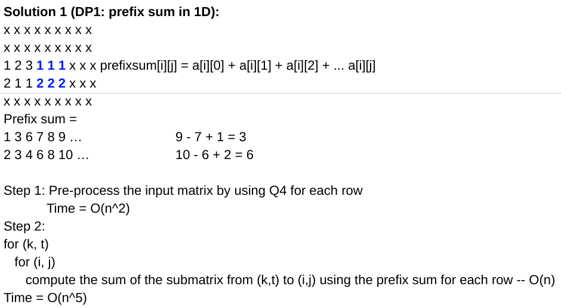
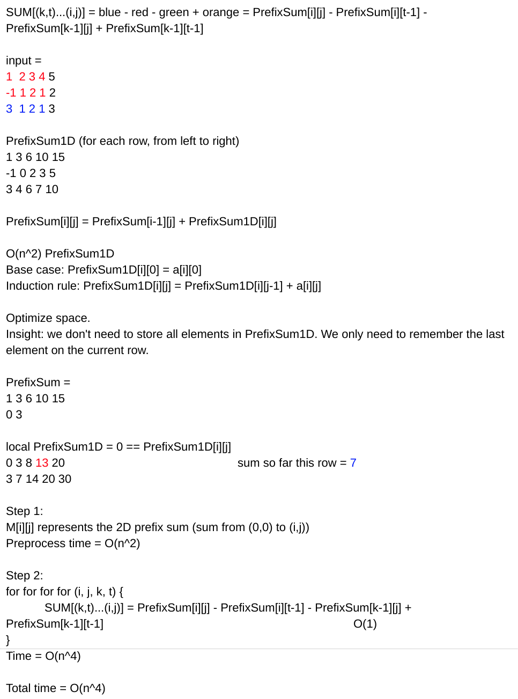
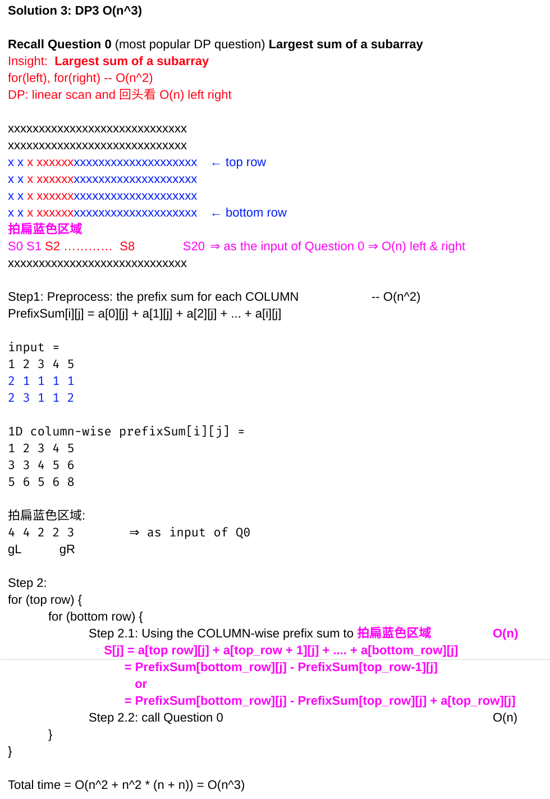

<!----- Conversion time: 3.461 seconds.


Using this Markdown file:

1. Cut and paste this output into your source file.
2. See the notes and action items below regarding this conversion run.
3. Check the rendered output (headings, lists, code blocks, tables) for proper
   formatting and use a linkchecker before you publish this page.

Conversion notes:

* Docs to Markdown version 1.0β14
* Mon Jan 21 2019 02:56:30 GMT-0800 (PST)
* Source doc: https://docs.google.com/open?id=1Y1lBoiaYv7QGyjWScIcynaqOAtRksHWCvZhCGr17hoc
* This document has images: check for >>>>>  gd2md-html alert:  inline image link in generated source and store images to your server.
----->


# Largest SubMatrix Sum

[https://app.laicode.io/app/problem/106](https://app.laicode.io/app/problem/106)


## Description

Given a matrix that contains integers, find the submatrix with the largest sum.

Return the sum of the submatrix.

Assumptions


*   The given matrix is not null and has size of M * N, where M >= 1 and N >= 1

Examples

{ {1, -2, -1, 4},

  {1, -1,  1, 1},

  {0, -1, -1, 1},

  {0,  0,  1, 1} }

the largest submatrix sum is (-1) + 4 + 1 + 1 + (-1) + 1 + 1 + 1 = 7.

Hard

2 D Array


## Assumption

As stated above in the description


## Algorithm


1.  Solution 0: Non-DP
    1.  There are O(n^4) submatrices
    2.  for-for-for-for each submatrix, it takes O(n^2) to calculate its sum
    3.  total time ⇒ O(n^6)
2.  Solution 1: DP1 - Prefix Sum in 1D

    

3.  Solution 2: DP2 - Prefix Sum in 2D

    

    

4.  Solution 3: DP3 (O(n^3))

    

    1.  This is the one that is implemented here


## Solution


### Code


```java
public class Solution {
  public int largest(int[][] matrix) {
    // Write your solution here
    if (matrix == null || matrix.length == 0 ||
        matrix[0] == null || matrix[0].length == 0) {
      return 0;
    }
    int rows = matrix.length;
    int cols = matrix[0].length;
    int result = Integer.MIN_VALUE;
    // Compute the prefix sum for each row (column-wise)
    for (int row = 0; row < rows; row++) {
      // Column-wisely, compute the sum of
      // all following rows
      int[] prefixRow = new int[cols];
      for (int i = row; i < rows; i++) {
        // For each column in this row, add up the
        // same column in all following rows
        addColumns(prefixRow, matrix[i]);
        // Look for the max subarray sum in this
        // column-wise prefix row sums
        result = Math.max(result, maxSubarraySum(prefixRow));
      }
    }
    return result;
  }

  private void addColumns(int[] prefixRow, int[] currentRow) {
    for (int i = 0; i < prefixRow.length; i++) {
      // Add up the corresponding columns in all following rows
      prefixRow[i] += currentRow[i];
    }
  }

  private int maxSubarraySum(int[] array) {
    int currentSum = array[0];
    int maxSum = array[0];
    for (int i = 1; i < array.length; i++) {
      currentSum = Math.max(currentSum + array[i], array[i]);
      maxSum = Math.max(maxSum, currentSum);
    }
    return maxSum;
  }
}
```


### Complexity


#### Time

It takes O(n) to compute the column-wise prefix sum for each row. For each row, it takes O(n) to get the max subarray sum. And we need to do this for all n rows. ⇒ O(n^3)


#### Space

A 1D array for the prefix sum is created for each row ⇒ O(n^2)


<!-- Docs to Markdown version 1.0β14 -->
