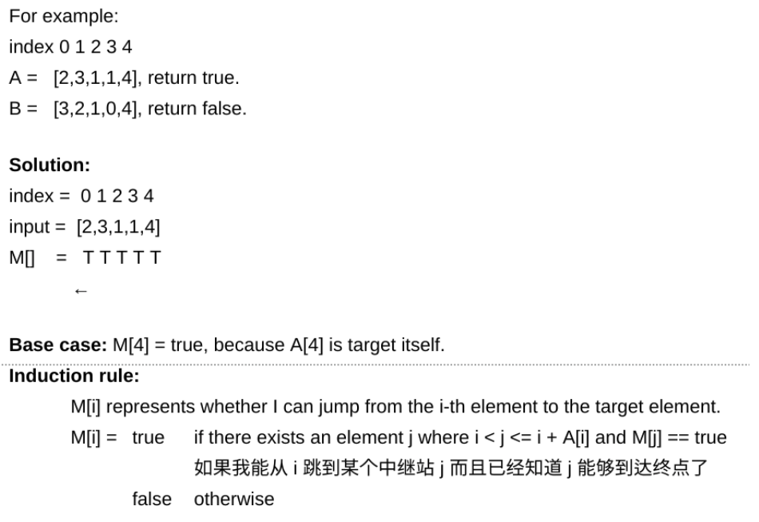

<!----- Conversion time: 1.278 seconds.


Using this Markdown file:

1. Cut and paste this output into your source file.
2. See the notes and action items below regarding this conversion run.
3. Check the rendered output (headings, lists, code blocks, tables) for proper
   formatting and use a linkchecker before you publish this page.

Conversion notes:

* Docs to Markdown version 1.0β14
* Wed Jan 16 2019 18:24:13 GMT-0800 (PST)
* Source doc: https://docs.google.com/open?id=1SNw5CS09gxiCVkuSh4CvUBF9cX1U0IA6Q9AOiZrF3bQ
* This document has images: check for >>>>>  gd2md-html alert:  inline image link in generated source and store images to your server.
----->


# Array Hopper I

[https://app.laicode.io/app/problem/88](https://app.laicode.io/app/problem/88)


---


## Description

Given an array A of non-negative integers, you are initially positioned at index 0 of the array. A[i] means the maximum jump distance from that position (you can only jump towards the end of the array).Determine if you are able to reach the last index.

Assumptions


*   The given array is not null and has length of at least 1.

Examples


*   {1, 3, 2, 0, 3}, we are able to reach the end of array(jump to index 1 then reach the end of the array)
*   {2, 1, 1, 0, 2}, we are not able to reach the end of array

Medium

Greedy


## Assumption

When the array is null or the length of the array is 0, we assume it is impossible to do any hops.


## Algorithm

Instead of looking from left to right of the array, we can do it inversely.

Maintain a boolean array to record whether it is possible to reach the end by one or several hops from the current index.

At the beginning, when we are at the end of the array, we are already at the finish line, so the base case is M\[end] = true.

As we hop backwards towards the beginning of the array, at index i, we check:


1.  if i + array\[i] >= n ⇒ M\[i] = true
1.  if i + array\[i] < n
    1.  for 0 → array\[i], if there exists any number j such that array\[i + j] == true ⇒ M\[i] = true





## Solution


### Code


```java
public class Solution {
    public boolean canJump(int[] array) {
        // Write your solution here
        if (array == null || array.length == 0) {
            return false;
        }
        int n = array.length;
        boolean[] canHop = new boolean[n];
        canHop[n - 1] = true; // Already at the end
        for (int i = n - 2; i >= 0; i--) {
            if (i + array[i] >= n - 1) {
                // If the current position + max number of hops possible
                // right here >= end, we are guaranteed to be able to
                // reach the end
                canHop[i] = true;
            } else {
                // If we are not able to jump to/over the end from the
                // current position, we need to check and see whether
                // we can get to the end by jumping to any available
                // positions afterwards
                // Possible number of hops: 1 -> array[i] inclusively
                // Linear scan & look back (forward)
                for (int j = 1; j <= array[i]; j++) {
                    if (canHop[i + j]) {
                        canHop[i] = true;
                        break;
                    }
                }
            }
        }
        return canHop[0];
    }
}
```


### Complexity

Time:

n index to check. For each index, we need to check at most another n index ⇒ O(n^2)

Space:

boolean[] canHop = new boolean\[n] ⇒ O(n)


<!-- Docs to Markdown version 1.0β14 -->
