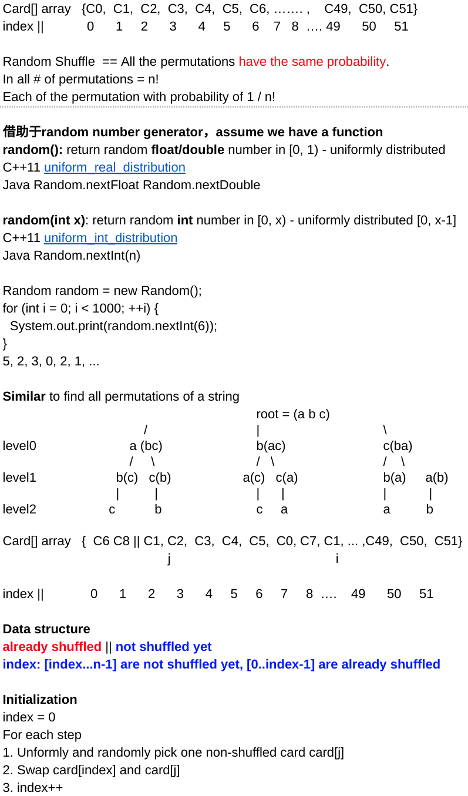

<!----- Conversion time: 1.839 seconds.


Using this Markdown file:

1. Cut and paste this output into your source file.
2. See the notes and action items below regarding this conversion run.
3. Check the rendered output (headings, lists, code blocks, tables) for proper
   formatting and use a linkchecker before you publish this page.

Conversion notes:

* Docs to Markdown version 1.0β14
* Mon Jan 21 2019 03:49:34 GMT-0800 (PST)
* Source doc: https://docs.google.com/open?id=1GGLYuOUrTJFhJPLdPz7ZtcMW_4OHkARfZ3-hBo1PSDM
* This document has images: check for >>>>>  gd2md-html alert:  inline image link in generated source and store images to your server.
----->


# Perfect Shuffle

[https://app.laicode.io/app/problem/108](https://app.laicode.io/app/problem/108)


## Description

Given an array of integers (without any duplicates), shuffle the array such that all permutations are equally likely to be generated.

Assumptions


*   The given array is not null

Medium

Probability

Sampling And Randomization


## Assumption

The input array should not be null or empty


## Algorithm

Shuffling algorithms, such as the shuffling of card decks, usually utilize a random number generator to get a random number in a certain range. For example, 52 cards deck shuffle:





For n numbers, at step i, we generate a random integer from 0 to (n - i) with random(n - i), then we do rand + i to make this number become a randomly generated number in the range from i to n. In this way, we keep the property that everything to the left of index i has already been shuffled and everything to the right of index i is waiting to get shuffled.


## Solution


### Code


```java
public class Solution {
  public void shuffle(int[] array) {
    // Write your solution here.
    if (array == null || array.length <= 1) {
      return;
    }
    Random random = new Random();
    int n = array.length;
    for (int i = 0; i < n; i++) {
      // Generate a random index from i to n
      int rand = random.nextInt(n - i) + i;
      // [0, index) are shuffled section
      // [index, end] are yet to be shuffled
      // Swap the shuffled card to the result section
      int temp = array[i];
      array[i] = array[rand];
      array[rand] = temp;
    }
  }
}
```


### Complexity

Time: one single iteration in which there is an O(1) random number generation + O(1) swap ⇒ O(n)

Space: O(1)


<!-- Docs to Markdown version 1.0β14 -->
