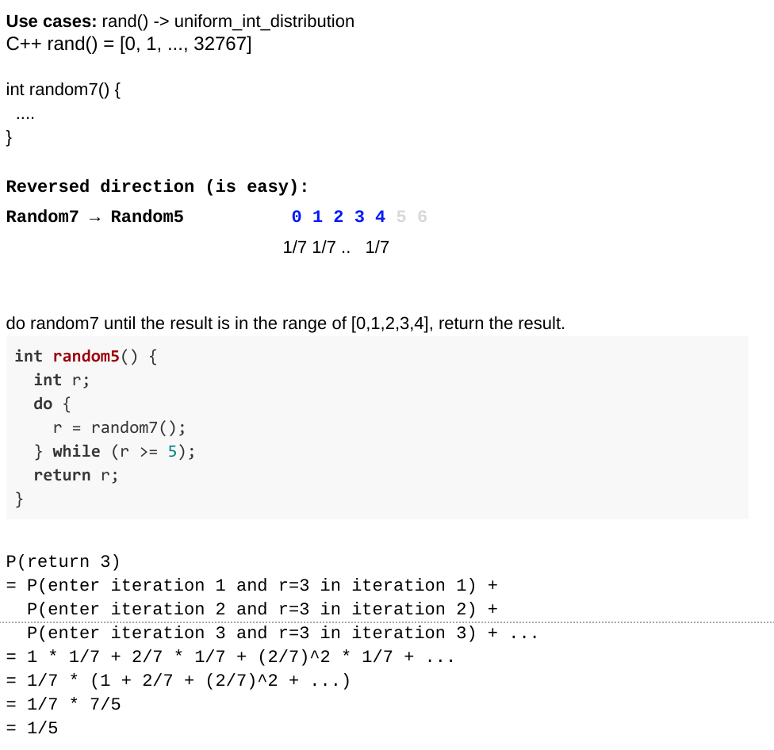

<!----- Conversion time: 1.804 seconds.


Using this Markdown file:

1. Cut and paste this output into your source file.
2. See the notes and action items below regarding this conversion run.
3. Check the rendered output (headings, lists, code blocks, tables) for proper
   formatting and use a linkchecker before you publish this page.

Conversion notes:

* Docs to Markdown version 1.0β14
* Mon Jan 21 2019 04:44:23 GMT-0800 (PST)
* Source doc: https://docs.google.com/open?id=1Vynihwn3E8Rjk09uMLnF46dOBDRmQC2McCqcQ9E7yXw
* This document has images: check for >>>>>  gd2md-html alert:  inline image link in generated source and store images to your server.
----->


# Random7 Using Random5

[https://app.laicode.io/app/problem/111](https://app.laicode.io/app/problem/111)


## Description

Given a random generator random5(), the return value of random5() is 0 - 4 with equal probability. Use random5() to implement random7().

Medium

Probability

Sampling And Randomization


## Assumption

A random5() method is provided and can be called by RandomFive.random5()


## Algorithm

The random number generators need to generate results that are uniformly distributed. E.g.,

random5() ⇒ 1/5 return 0, 1, 2, 3, 4

random7() ⇒ 1/7 return 0, 1, 2, 3, 4, 5, 6

Our goal is:

	public int random7() {

	  … random5() …

	}

**_An example of a WRONG implementation!_**





**_Correct implementation:_**


## Solution


### Code


```java
public class Solution {
  public int random7() {
    // write your solution here
    // you can use RandomFive.random5() for generating
    // 0 - 4 with equal probability.
    int result = 0;
    while (true) {
      int rand = 5 * RandomFive.random5() + RandomFive.random5();
      if (rand < 21) {
        result = rand % 7;
        break;
      }
    }
    return result;
  }
}
```


### Complexity


#### Time

content


#### Space

content


<!-- Docs to Markdown version 1.0β14 -->
