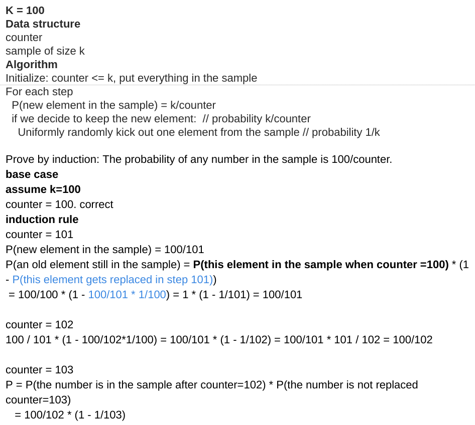

<!----- Conversion time: 1.195 seconds.


Using this Markdown file:

1. Cut and paste this output into your source file.
2. See the notes and action items below regarding this conversion run.
3. Check the rendered output (headings, lists, code blocks, tables) for proper
   formatting and use a linkchecker before you publish this page.

Conversion notes:

* Docs to Markdown version 1.0β14
* Mon Jan 21 2019 04:15:05 GMT-0800 (PST)
* Source doc: https://docs.google.com/open?id=1jUo3Z_55aVxMwicuwZanZ-PaO6vbaPb7t3W7-AI7-gg
* This document has images: check for >>>>>  gd2md-html alert:  inline image link in generated source and store images to your server.
----->


# Reservoir Sampling

[https://app.laicode.io/app/problem/109](https://app.laicode.io/app/problem/109)


## Description

Consider an unlimited flow of data elements. How do you sample one element from this flow, such that at any point during the processing of the flow, you can return a random element from the n elements read so far.

You will implement two methods for a sampling class:


*   read(int value) - read one number from the flow
*   sample() - return at any time the sample, if n values have been read, the probability of returning any one of the n values is 1/n, return null(Java)/INT_MIN(C++) if there is no value read so far

You may need to add more fields for the class.

Medium

Probability

Sampling And Randomization


## Assumption

Input is a stream of unknown/unlimited size


## Algorithm

_[Reservoir Sampling](https://en.wikipedia.org/wiki/Reservoir_sampling)_ is a family of randomized algorithms for randomly choosing **a sample of k items** from a list _S_ containing **_n_ items**, where _n_ is either a very large or unknown number.

Typically, _n_ is large enough that the list does not fit into main memory and it is fed as a stream.





## Solution


### Code


```java
public class Solution {
  private int count;
  private Integer sample;

  public Solution() {
    // Write your constructor code here if necessary
    // Variable count records the total number of input read so far
    count = 0;
    // Variable sample represents the current sample
    sample = null;
  }

  public void read(int value) {
    // Write your implementation here
    // One call to the read() method == one input read
    count++;
    // With the updated number of inputs read so far
    // Generate a random number between [0, count)
    Random random = new Random();
    int prob = random.nextInt(count);
    // The probability of any one number gets generated
    // is 1/count. Therefore, let the prob variable to be
    // any one of them, and the probability of this current
    // read value is the current sample is 1/count
    if (prob == 0) {
      sample = value;
    }
  }

  public Integer sample() {
    // Write your implementation here
    return sample;
  }
}
```


### Complexity


#### Time

Assume the number of elements read so far is n.

Randomly generate an integer between [0, n) ⇒ O(n) if you like ⇒ O(1)


#### Space

Constant space ⇒ O(1)


<!-- Docs to Markdown version 1.0β14 -->
