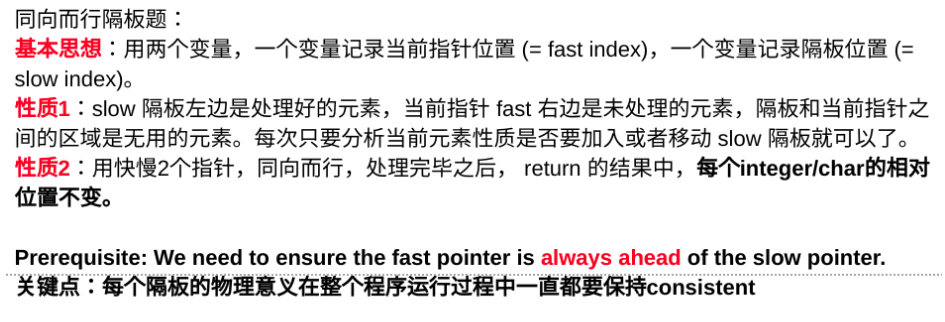
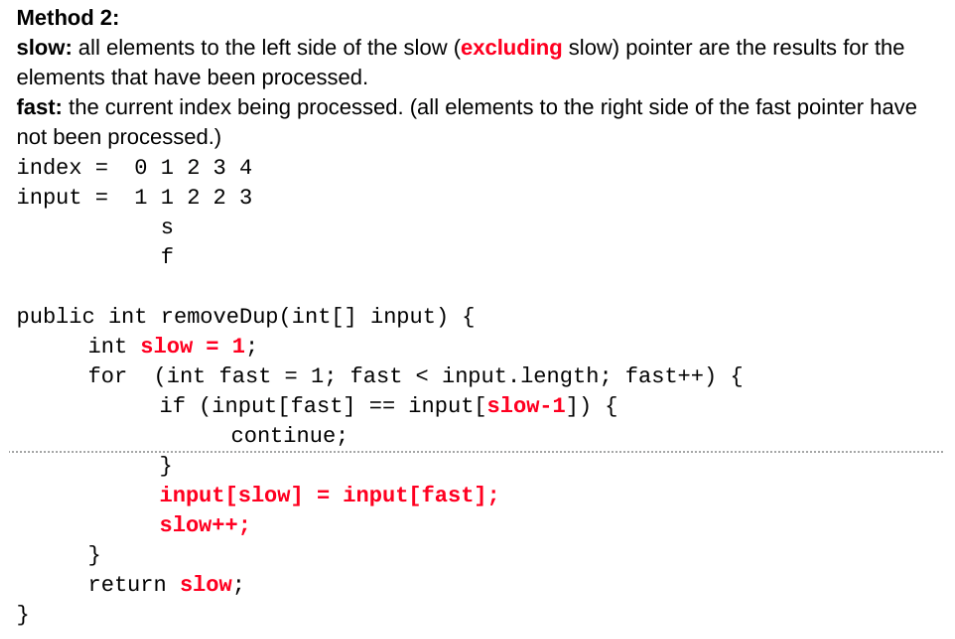

<!----- Conversion time: 1.596 seconds.


Using this Markdown file:

1. Cut and paste this output into your source file.
2. See the notes and action items below regarding this conversion run.
3. Check the rendered output (headings, lists, code blocks, tables) for proper
   formatting and use a linkchecker before you publish this page.

Conversion notes:

* Docs to Markdown version 1.0β14
* Wed Jan 23 2019 19:09:38 GMT-0800 (PST)
* Source doc: https://docs.google.com/open?id=139P23GJfFGs_wiypCcGQF990l-_XwLED07GrBzlZB9c
* This document has images: check for >>>>>  gd2md-html alert:  inline image link in generated source and store images to your server.
----->


# Array Deduplication I

[https://app.laicode.io/app/problem/115](https://app.laicode.io/app/problem/115)

[https://leetcode.com/problems/remove-duplicates-from-sorted-array/description/](https://leetcode.com/problems/remove-duplicates-from-sorted-array/description/)

[https://www.lintcode.com/problem/remove-duplicates-from-sorted-array/description](https://www.lintcode.com/problem/remove-duplicates-from-sorted-array/description)


## Description

Given a sorted integer array, remove duplicate elements. For each group of elements with the same value keep only one of them. Do this in-place, using the left side of the original array and maintain the relative order of the elements of the array. Return the array after deduplication.

Assumptions


*   The array is not null

Examples


*   {1, 2, 2, 3, 3, 3} → {1, 2, 3}

Easy

Array


## Assumption

Because there can be at most 1 copy for each unique element, the array should have at least 1 element in it.


## Algorithm

Use fast-slow pointer


1.  All the elements to the left of the slow pointer, including the one pointed to by the slow pointer, are processed portion of the input
1.  All the elements to the right of the fast pointer are the portion of the input that is to be processed
1.  All the elements in the middle of the slow and fast pointer are the ones that have been processed but useless in terms of return value




## Solution


### Code


```java
public class Solution {
  public int[] dedup(int[] array) {
    // Write your solution here
    if (array == null || array.length <= 1) {
      return array;
    }
    // Two pointers:
    // 1. array[0, slow]: processed for result
    // 2. array(slow, fast): processed useless
    // 3. array[fast, end]: yet to be processed
    int slow = 0;
    for (int fast = 1; fast < array.length; fast++) {
      // We are only interested in the case
      // when two elements are different
      if (array[slow] != array[fast]) {
        array[++slow] = array[fast];
      }
    }
    // array[0, slow] is the part for result
    int[] result = new int[slow + 1];
    for (int i = 0; i <= slow; i++) {
      result[i] = array[i];
    }
    return result;
  }
}
```


### Complexity

Time: one iteration over the entire array of n elements + one iteration from 0 to slow number of elements in the array ⇒ O(n)

Space: only a slow pointer is created ⇒ O(1)


### Alternative method





<!-- Docs to Markdown version 1.0β14 -->
