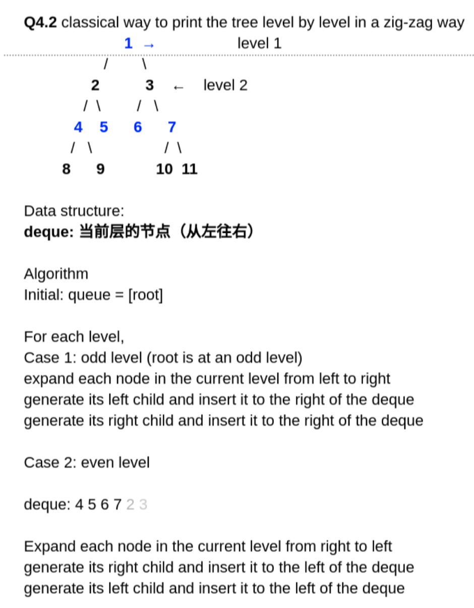

<!----- Conversion time: 1.592 seconds.


Using this Markdown file:

1. Cut and paste this output into your source file.
2. See the notes and action items below regarding this conversion run.
3. Check the rendered output (headings, lists, code blocks, tables) for proper
   formatting and use a linkchecker before you publish this page.

Conversion notes:

* Docs to Markdown version 1.0β14
* Fri Jan 25 2019 01:11:07 GMT-0800 (PST)
* Source doc: https://docs.google.com/open?id=1UHTkhXPCXa94og_MPxpgIqhZdd_EvmL0RB2Hj5vJlj4
* This document has images: check for >>>>>  gd2md-html alert:  inline image link in generated source and store images to your server.
----->


# Get Keys in Binary Tree Layer by Layer Zig-Zag Order

[https://app.laicode.io/app/problem/58](https://app.laicode.io/app/problem/58)


## Description

Get the list of keys in a given binary tree layer by layer in zig-zag order.

Examples

            5

          /    \

        3        8

      /   \        \

     1     4        11

the result is \[5, 3, 8, 11, 4, 1]

Corner Cases


*   What if the binary tree is null? Return an empty list in this case.

How is the binary tree represented?

We use the level order traversal sequence with a special symbol "#" denoting the null node.

For Example:

The sequence \[1, 2, 3, #, #, 4] represents the following binary tree:

        1

      /   \

     2     3

          /

        4

Medium

Binary Tree

Breadth First Search


## Assumption

The tree should at least have a root.


## Algorithm

This is a modification of [Binary Tree Level Order Traversal](../../../../../G/HeapAndBFS/Easy/GetKeysInBinaryTreeLayerByLayer)

Instead of using a queue, we need to use a **deque** for this one. Take the first tree for example.

            5			level 1

          /    \

        3        8		level 2

      /   \        \

     1     4        11		level 3

We should poll and offer the nodes to the deque in different directions for odd and even levels such that the poll/offer operation will not mess up what the deque already has.


1.  When we are at level 1, we need to add 3 and 8 to the deque, so the deque is {3, 8} at the moment.
1.  At level 2, because we are supposed to poll 3 out of the deque first ⇒ we need a way to do pollFirst() for even levels.
    1.  level % 2 == 0 ⇒ pollFirst()
    1.  after polling 3 out of the deque, the deque is {8}
    1.  the designated ordering of level 3 is \[11, 4, 1]. Because of step a, we have level % 2 != 0 ⇒ pollLast() ⇒ 11 should be at the end of the deque ⇒ 1 should be added towards the head of the deque
        1.  if left child != null ⇒ deque.offerLast(left child)
        1.  if right child != null ⇒ deque.offerLast(right child)
1.  At level 3 ⇒ level % 2 != 0 ⇒ do pollLast()
    1.  if any of the nodes in level 3 has children, to maintain the designated order and avoid messing up the other nodes left in the current level
        1.  deque = {1, 4, 11} at the beginning
        1.  if 11 has both left and right children
            1.  level four should be in order \[left child, right child]
            1.  add right child, then left child to the head
            1.  deque = {left, right, 1, 4} ⇒ pollLast() still works





## Solution


### Code


```java
/**
 * public class TreeNode {
 *   public int key;
 *   public TreeNode left;
 *   public TreeNode right;
 *   public TreeNode(int key) {
 *     this.key = key;
 *   }
 * }
 */
public class Solution {
  public List<Integer> zigZag(TreeNode root) {
    // Write your solution here
    List<Integer> result = new ArrayList<>();
    if (root == null) {
      return result;
    }
    Deque<TreeNode> deque = new ArrayDeque<>();
    deque.offerFirst(root);
    int level = 0;
    while (!deque.isEmpty()) {
      // We are entering a new level
      level++;
      // This is still a variation of level-order traversal
      int size = deque.size();
      for (int i = 0; i < size; i++) {
        // 1. Even level: pollFirst() and offerLast()
        // 2. Odd level:  pollLast()  and offerFirst()
        TreeNode node = level % 2 == 0 ? deque.pollFirst() :
                                         deque.pollLast();
        result.add(node.key);
        if (level % 2 != 0) {
          // In odd level
          // Because we do pollLast() to get the nodes from deque
          // we need to offerFirst() the right child then left child
          // to maintain the order and not mess up polling other nodes
          // in the current level
          if (node.right != null) {
            deque.offerFirst(node.right);
          }
          if (node.left != null) {
            deque.offerFirst(node.left);
          }
        } else {
          // In even level
          // Because we do pollFirst() to get the nodes from deque
          // we need to offerLast() the left child then right child
          // to maintain the order and not mess up polling other nodes
          // in the current level
          if (node.left != null) {
            deque.offerLast(node.left);
          }
          if (node.right != null) {
            deque.offerLast(node.right);
          }
        }
      }
    }
    return result;
  }
}
```


### Complexity

Time:

Traversing the whole tree means checking every single node in it ⇒ O(n)

Space:

A deque is used in the process ⇒ O(n)


<!-- Docs to Markdown version 1.0β14 -->
