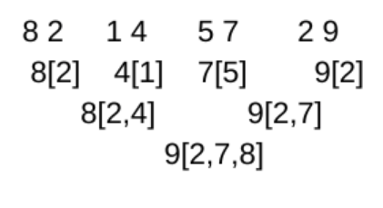

<!----- Conversion time: 1.081 seconds.


Using this Markdown file:

1. Cut and paste this output into your source file.
2. See the notes and action items below regarding this conversion run.
3. Check the rendered output (headings, lists, code blocks, tables) for proper
   formatting and use a linkchecker before you publish this page.

Conversion notes:

* Docs to Markdown version 1.0β14
* Thu Jan 24 2019 04:21:11 GMT-0800 (PST)
* Source doc: https://docs.google.com/open?id=1lRpKWkyzqflQCa-Wmh1582ZpAtVvq5iPUEKcvUf0Vw4
* This document has images: check for >>>>>  gd2md-html alert:  inline image link in generated source and store images to your server.
----->


# Largest and Second Largest

[https://app.laicode.io/app/problem/120](https://app.laicode.io/app/problem/120)


## Description

Use the least number of comparisons to get the largest and 2nd largest number in the given integer array. Return the largest number and 2nd largest number.

Assumptions


*   The given array is not null and has length of at least 2

Examples


*   {2, 1, 5, 4, 3}, the largest number is 5 and 2nd largest number is 4.

Medium

Array


## Assumption

The input array should not be null or empty


## Algorithm

Similar to the previous problem, we can compare the elements in pairs: 0 vs end, 1 vs end - 1, …

And swap the larger element to the left half of the array. Whenever we do swap, which indicates that we see a difference in these two values, we need to record the comparison history of the larger value. Then,


1.  Look for the max value in the first half of the array which contains all the larger values. For each comparison, update the comparison history of the larger element.
1.  Look for the max value in the comparison history of the max value from step 1.





## Solution


### Code


```java
public class Solution {
  public int[] largestAndSecond(int[] array) {
    // Write your solution here
    if (array == null || array.length == 0) {
      return new int[] {};
    }
    int n = array.length;
    // Step 1: compare pairs
    // 1. put the larger numbers to the left
    // 2. record the comparison history
    Map<Integer, List<Integer>> history = new HashMap<>();
    for (int i = 0; i < n / 2; i++) {
      if (array[i] < array[n - 1 - i]) {
        swap(array, i, n - 1 - i);
      }
      // Keep track of the comparison history
      // <larger number, <smaller numbers it has compared against>>
      updateHistory(array[i], array[n - 1 - i], history);
    }
    // Step 2: find the max in array[0, n/2]
    int first = array[0];
    for (int i = 1; i <= n / 2; i++) {
      // We are still making comparisons
      // So we need to keep track of the history
      // When the two numbers are equal
      // We need to record this comparison
      // Because the largest and second largest could be the same
      if (array[i] >= first) {
        updateHistory(array[i], first, history);
        first = array[i];
      } else {
        updateHistory(first, array[i], history);
      }
    }
    // Step 3: find the max in first's history
    int second = Integer.MIN_VALUE;
    for (int number : history.get(first)) {
      if (number > second) {
        second = number;
      }
    }
    return new int[] {first, second};
  }

  private void swap(int[] array, int left, int right) {
    int temp = array[left];
    array[left] = array[right];
    array[right] = temp;
  }

  private void updateHistory(int large, int small,
                             Map<Integer, List<Integer>> history) {
    List<Integer> compared = history.getOrDefault(large,
                                                  new ArrayList<>());
    compared.add(small);
    history.put(large, compared);
  }
}
```


### Complexity

Time:

first two iterations of n / 2 comparisons == O(2 * n/2) + third iteration of log(n) elements ⇒ O(n + log(n))

Space:

HashMap ⇒ O(n)


<!-- Docs to Markdown version 1.0β14 -->
