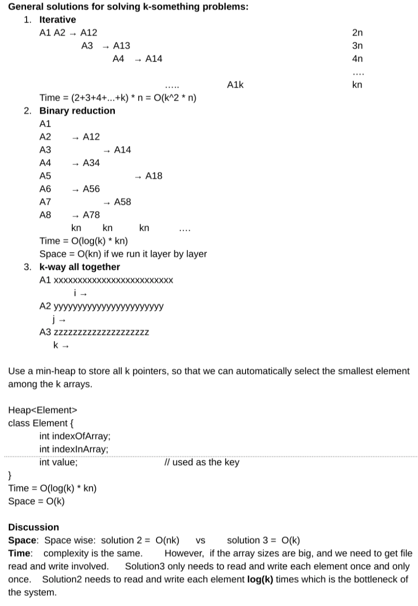

<!----- Conversion time: 1.777 seconds.


Using this Markdown file:

1. Cut and paste this output into your source file.
2. See the notes and action items below regarding this conversion run.
3. Check the rendered output (headings, lists, code blocks, tables) for proper
   formatting and use a linkchecker before you publish this page.

Conversion notes:

* Docs to Markdown version 1.0β14
* Mon Jan 28 2019 05:48:05 GMT-0800 (PST)
* Source doc: https://docs.google.com/open?id=1cmb8rLV_8KrxF0n_e-ti9OsYD2pE4zWTAxrMF_blFZg
* This document has images: check for >>>>>  gd2md-html alert:  inline image link in generated source and store images to your server.
----->


# Merge K Sorted Array

[https://app.laicode.io/app/problem/133](https://app.laicode.io/app/problem/133)


## Description

Merge K sorted array into one big sorted array in ascending order.

Assumptions


*   The input arrayOfArrays is not null, none of the arrays is null either.

Medium

Heap


## Assumption

None of the input arrays should be null or empty.

All of the arrays are sorted in ascending order.


## Algorithm





The size of the arrayOfArrays is not necessarily k x n. There are k arrays, but the arrays may have different lengths.


## Solution


### Code


```java
public class Solution {
  public int[] merge(int[][] arrayOfArrays) {
    // Write your solution here
    if (arrayOfArrays == null || arrayOfArrays.length == 0) {
      return new int[] {};
    }
    // Use a min heap to store the current k smallest numbers
    // from the k arrays
    int k = arrayOfArrays.length;
    Queue<Element> minHeap = new PriorityQueue<>(k);
    // The length of each array may not be the same
    int totalLength = 0;
    for (int i = 0; i < k; i++) {
      int[] currentArray = arrayOfArrays[i];
      // Skip any empty arrays
      if (currentArray.length == 0) {
        continue;
      }
      // Update the total length and offer the first
      // number in this array to the heap
      totalLength += currentArray.length;
      minHeap.offer(new Element(i, 0, currentArray[0]));
    }
    // The min heap has the first numbers of each one
    // of the k arrays now. Start polling elements
    int[] result = new int[totalLength];
    int index = 0;
    while (!minHeap.isEmpty()) {
      // Add the current top element to the result
      Element element = minHeap.poll();
      result[index++] = element.value;
      // Fill the empty space in the heap with the next element
      // in this array
      int indexOfArray = element.indexOfArray;
      int indexInArray = element.indexInArray + 1;
      if (indexInArray < arrayOfArrays[indexOfArray].length) {
        minHeap.offer(new Element(
            indexOfArray, indexInArray,
            arrayOfArrays[indexOfArray][indexInArray]));
      }
    }
    return result;
  }
}

class Element implements Comparable<Element> {
  int indexOfArray;
  int indexInArray;
  int value;

  Element (int indexOfArray, int indexInArray, int value) {
    this.indexOfArray = indexOfArray;
    this.indexInArray = indexInArray;
    this.value = value;
  }

  @Override
  public int compareTo(Element other) {
    if (this.value == other.value) {
      return 0;
    }
    return this.value < other.value? -1 : 1;
  }
}
```


### Complexity


#### Time

First loop to get the total length and setup the initial k elements in the min heap ⇒ O(k)

For each n elements in all k arrays, we need to offer them to the heap and poll the smallest one out.

All n elements in k arrays ⇒ O(k * n)

Offer and poll in the heap ⇒ O(log(k))


#### Space

A min heap of size k is used ⇒ O(k)


<!-- Docs to Markdown version 1.0β14 -->
